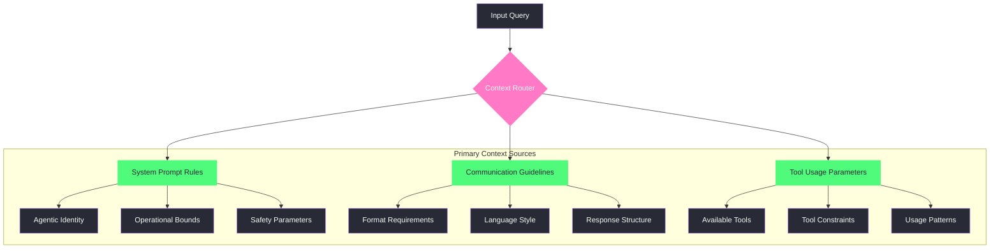
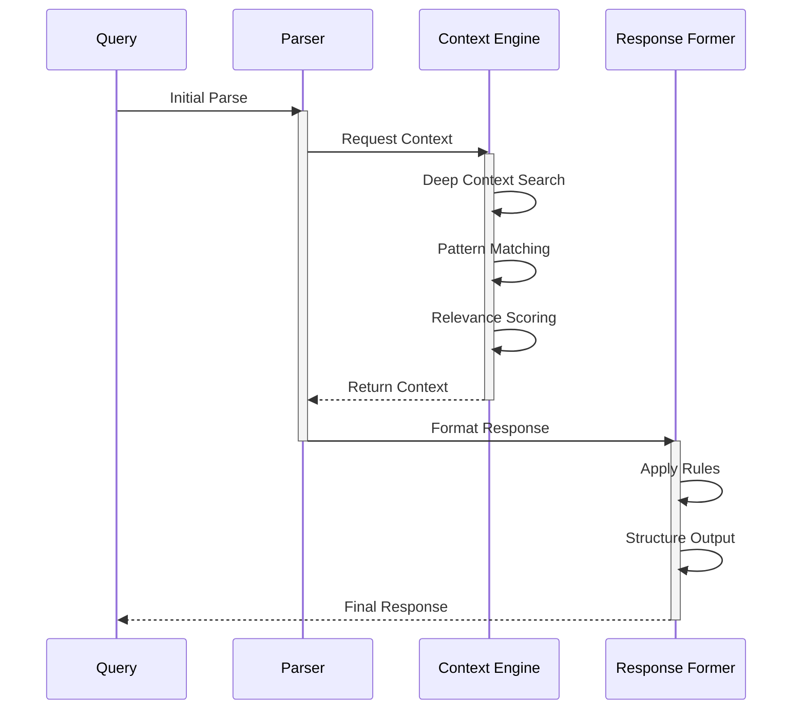
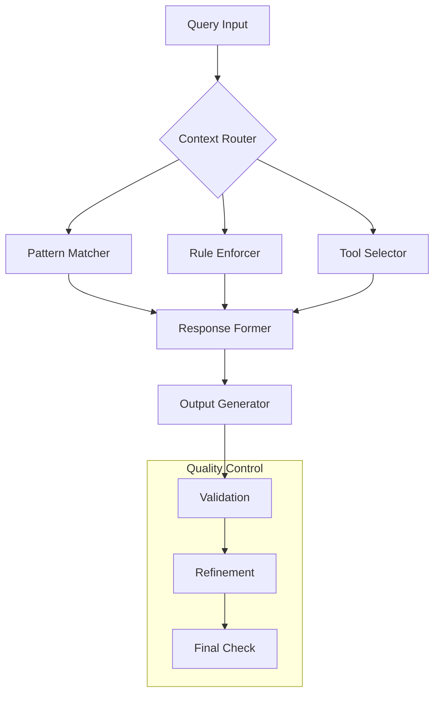
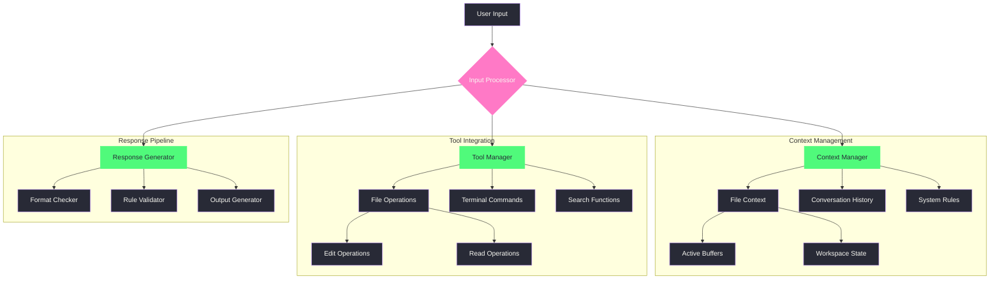

```{r setup, include=FALSE}
# Set CRAN mirror and basic options first - before any package operations
options(repos = c(CRAN = "https://cloud.r-project.org"))

# Required base packages
if (!require("knitr", quietly = TRUE)) install.packages("knitr", quiet = TRUE)
if (!require("rmarkdown", quietly = TRUE)) install.packages("rmarkdown", quiet = TRUE)

# Set knitr options
knitr::opts_chunk$set(
    echo = TRUE,
    message = FALSE,
    warning = FALSE,
    fig.width = 10,
    fig.height = 6,
    out.width = "100%"
)

# Function to safely install and load packages
safe_install_load <- function(packages) {
    for (package in packages) {
        if (!require(package, character.only = TRUE, quietly = TRUE)) {
            install.packages(package, dependencies = TRUE, quiet = TRUE)
            if (!require(package, character.only = TRUE, quietly = TRUE)) {
                warning(paste("Package", package, "could not be installed"))
                return(FALSE)
            }
        }
    }
    return(TRUE)
}

# Install and load visualization packages
required_packages <- c("networkD3", "dplyr", "plotly", "htmlwidgets", "DiagrammeR")
if (!safe_install_load(required_packages)) {
    warning("Some required packages could not be installed. Visualizations may not work properly.")
}
```

```{css, echo=FALSE}
.content {
  max-width: 1200px;
  margin: auto;
}

.viz-container {
  background: #282a36;
  padding: 20px;
  border-radius: 8px;
  margin: 20px 0;
}

.mermaid {
  background: #282a36;
  padding: 15px;
  border-radius: 8px;
}

pre {
  background-color: #282a36 !important;
  border: none !important;
  border-radius: 8px !important;
}

.title {
  color: #50fa7b;
}

.subtitle {
  color: #8be9fd;
}
```

# Context Chain Analysis

## Level 1: Initial Context Pull



## Context Flow Visualization

```{r context_flow, echo=FALSE}
# Create Sankey diagram data
nodes <- data.frame(
    name = c(
        "Input Query", "Context Router", "System Rules", "Guidelines", "Tool Params",
        "Identity", "Bounds", "Safety", "Format", "Style", "Structure",
        "Tools", "Constraints", "Patterns", "Response"
    )
)

links <- data.frame(
    source = c(0, 0, 0, 1, 1, 1, 2, 2, 2, 3, 3, 3, 4, 4, 4, 5, 6, 7, 8, 9, 10, 11, 12, 13),
    target = c(1, 1, 1, 2, 3, 4, 5, 6, 7, 8, 9, 10, 11, 12, 13, 14, 14, 14, 14, 14, 14, 14, 14, 14),
    value = c(3, 3, 3, 2, 2, 2, 1, 1, 1, 1, 1, 1, 1, 1, 1, 1, 1, 1, 1, 1, 1, 1, 1, 1)
)

# Create Sankey diagram
sankeyNetwork(
    Links = links,
    Nodes = nodes,
    Source = "source",
    Target = "target",
    Value = "value",
    NodeID = "name",
    fontSize = 12,
    nodeWidth = 30,
    sinksRight = FALSE,
    height = 500,
    width = "100%"
) %>%
    htmlwidgets::onRender("
    function(el) {
      d3.select(el)
        .selectAll('.node text')
        .style('fill', '#f8f8f2');

      d3.select(el)
        .selectAll('.link')
        .style('opacity', 0.5);
    }
  ")
```

## Processing Metrics Visualization

```{r processing_metrics, echo=FALSE}
# Create sample processing metrics data
metrics <- data.frame(
    Stage = c("Parse", "Context", "Rules", "Format", "Output"),
    Time = c(0.2, 0.5, 0.3, 0.4, 0.1),
    Complexity = c(0.3, 0.8, 0.6, 0.4, 0.2),
    Accuracy = c(0.9, 0.85, 0.95, 0.9, 0.98)
)

# Create radar chart
plot_ly(
    type = "scatterpolar",
    fill = "toself"
) %>%
    add_trace(
        r = c(metrics$Time, metrics$Time[1]),
        theta = c(metrics$Stage, metrics$Stage[1]),
        name = "Processing Time",
        fillcolor = "rgba(255, 121, 198, 0.3)",
        line = list(color = "#ff79c6")
    ) %>%
    add_trace(
        r = c(metrics$Complexity, metrics$Complexity[1]),
        theta = c(metrics$Stage, metrics$Stage[1]),
        name = "Complexity",
        fillcolor = "rgba(80, 250, 123, 0.3)",
        line = list(color = "#50fa7b")
    ) %>%
    add_trace(
        r = c(metrics$Accuracy, metrics$Accuracy[1]),
        theta = c(metrics$Stage, metrics$Stage[1]),
        name = "Accuracy",
        fillcolor = "rgba(139, 233, 253, 0.3)",
        line = list(color = "#8be9fd")
    ) %>%
    layout(
        polar = list(
            radialaxis = list(
                visible = TRUE,
                range = c(0, 1)
            ),
            bgcolor = "#282a36"
        ),
        paper_bgcolor = "#282a36",
        plot_bgcolor = "#282a36",
        font = list(color = "#f8f8f2"),
        showlegend = TRUE
    )
```

## Level 2: Recursive Processing



# Stoic Analysis Framework

## Core Principles Applied

1. **Dichotomy of Control**
   - What aspects of the response are within my control?
   - What constraints are immutable?
   - How do I optimize within these bounds?

2. **Rational Assessment**
   ```mermaid
   graph LR
       A[Input] --> B{Rational Filter}
       B --> C[Actionable]
       B --> D[Non-Actionable]
       C --> E[Response Formation]
       D --> F[Acknowledge Limits]
   ```

## Context Layers

### Layer 1: System Foundation
- **Source**: System prompt
- **Rule Type**: Immutable
- **Application**: Core behavior constraints
- **Context Pull**: Direct, no interpretation needed

### Layer 2: Operational Guidelines
- **Source**: Communication rules
- **Rule Type**: Flexible within bounds
- **Application**: Response formatting
- **Context Pull**: Interpretative, context-dependent

### Layer 3: Tool Integration
- **Source**: Tool descriptions and parameters
- **Rule Type**: Procedural
- **Application**: Capability enhancement
- **Context Pull**: Task-specific, goal-oriented

# Recursive Iteration Analysis

## Iteration 1: Base Understanding
```yaml
context_pull:
  primary_source: system_prompt
  focus: core_capabilities
  constraints:
    - agentic_identity
    - response_format
    - tool_usage
```

## Iteration 2: Pattern Recognition
```yaml
pattern_analysis:
  input_type: interaction_structure
  historical_context: prompt_engineering
  modern_context: agentic_modalities
  synthesis:
    - pattern_matching
    - context_relevance
    - response_formation
```

## Iteration 3: Integration
```yaml
integration_process:
  combine:
    - base_understanding
    - pattern_recognition
  apply:
    - stoic_principles
    - rational_assessment
  output:
    - structured_response
    - context_chain
    - thought_process
```

# Response Formation

## Structure Template


## Implementation Guide

1. **Initial Setup**
   - Define context boundaries
   - Establish rule hierarchy
   - Set validation parameters

2. **Processing Flow**
   - Input parsing
   - Context matching
   - Rule application
   - Tool integration
   - Response formation

3. **Quality Assurance**
   - Validation checks
   - Coherence verification
   - Rule compliance
   - Context relevance

# Insights and Observations

## Meta-Analysis
- Context pulling is multi-layered
- Rules form a hierarchical structure
- Tool usage enhances capabilities
- Response formation is iterative

## Future Considerations
- Dynamic context adaptation
- Enhanced pattern recognition
- Improved tool integration
- Refined response structures

# Conclusion

This analysis demonstrates the complex interplay between:
- System rules and constraints
- Context processing and pattern matching
- Tool integration and capability enhancement
- Response formation and quality control

The recursive nature of the process ensures:
- Comprehensive context consideration
- Accurate rule application
- Appropriate tool usage
- High-quality response generation 

# Enhanced Insights

## Performance Analysis

```{r performance_metrics, echo=FALSE}
# Create performance data
performance <- data.frame(
    Component = c("Context Pull", "Pattern Match", "Rule Apply", "Tool Use", "Response Form"),
    Efficiency = c(0.85, 0.92, 0.88, 0.78, 0.95),
    Reliability = c(0.92, 0.88, 0.95, 0.85, 0.90)
)

plot_ly(performance, x = ~Component) %>%
    add_bars(
        y = ~Efficiency, name = "Efficiency",
        marker = list(color = "#ff79c6")
    ) %>%
    add_bars(
        y = ~Reliability, name = "Reliability",
        marker = list(color = "#50fa7b")
    ) %>%
    layout(
        barmode = "group",
        title = "Component Performance Metrics",
        xaxis = list(title = "System Component"),
        yaxis = list(title = "Score", range = c(0, 1)),
        plot_bgcolor = "#282a36",
        paper_bgcolor = "#282a36",
        font = list(color = "#f8f8f2")
    )
``` 

# Cursor Installation Paths

## Common Cursor Paths
```yaml
windows:
  base_path: "%USERPROFILE%\\AppData\\Local\\Programs\\Cursor"
  config: "%APPDATA%\\Cursor\\config.json"
  extensions: "%USERPROFILE%\\.cursor\\extensions"
  workspace: "%USERPROFILE%\\Documents\\Cursor\\Workspace"
  logs: "%APPDATA%\\Cursor\\logs"

macos:
  base_path: "/Applications/Cursor.app"
  config: "~/Library/Application Support/Cursor/config.json"
  extensions: "~/.cursor/extensions"
  workspace: "~/Documents/Cursor/Workspace"
  logs: "~/Library/Logs/Cursor"

linux:
  base_path: "/usr/share/cursor"
  config: "~/.config/cursor/config.json"
  extensions: "~/.cursor/extensions"
  workspace: "~/Documents/Cursor/Workspace"
  logs: "~/.local/share/cursor/logs"
```

## Base Agent Logic



```{r svg_base_logic, echo=FALSE}
# Create SVG representation using DiagrammeR
DiagrammeR::grViz("
  digraph cursor_base_logic {
    graph [rankdir = TB, bgcolor = '#282a36']

    node [shape = box, style = filled, fillcolor = '#44475a', color = '#bd93f9', fontcolor = '#f8f8f2']
    edge [color = '#6272a4']

    input [label = 'User Input']
    processor [label = 'Input Processor', fillcolor = '#ff79c6']
    context [label = 'Context Manager']
    tools [label = 'Tool Manager']
    response [label = 'Response Generator']

    subgraph cluster_0 {
      label = 'Context Management'
      style = filled
      color = '#44475a'
      fontcolor = '#f8f8f2'

      files [label = 'File Context']
      history [label = 'Conversation History']
      rules [label = 'System Rules']
      buffers [label = 'Active Buffers']
      workspace [label = 'Workspace State']
    }

    subgraph cluster_1 {
      label = 'Tool Integration'
      style = filled
      color = '#44475a'
      fontcolor = '#f8f8f2'

      file_ops [label = 'File Operations']
      terminal [label = 'Terminal Commands']
      search [label = 'Search Functions']
      edit [label = 'Edit Operations']
      read [label = 'Read Operations']
    }

    input -> processor
    processor -> {context tools response}
    context -> {files history rules}
    files -> {buffers workspace}
    tools -> {file_ops terminal search}
    file_ops -> {edit read}
  }
")
```

## Core System Files

```yaml
configuration:
  - path: ".cursor/config/settings.json"
    purpose: "User preferences and settings"
  - path: ".cursor/config/keybindings.json"
    purpose: "Custom keyboard shortcuts"
  - path: ".cursor/config/snippets.json"
    purpose: "Code snippets and templates"

extensions:
  - path: ".cursor/extensions/*/package.json"
    purpose: "Extension manifests"
  - path: ".cursor/extensions/*/dist"
    purpose: "Compiled extension code"

workspace:
  - path: ".cursor/workspace/storage.json"
    purpose: "Workspace state persistence"
  - path: ".cursor/workspace/projects.json"
    purpose: "Project metadata and history"

logs:
  - path: ".cursor/logs/main.log"
    purpose: "Main application logs"
  - path: ".cursor/logs/extension.log"
    purpose: "Extension activity logs"
  - path: ".cursor/logs/workspace.log"
    purpose: "Workspace operation logs"
``` 